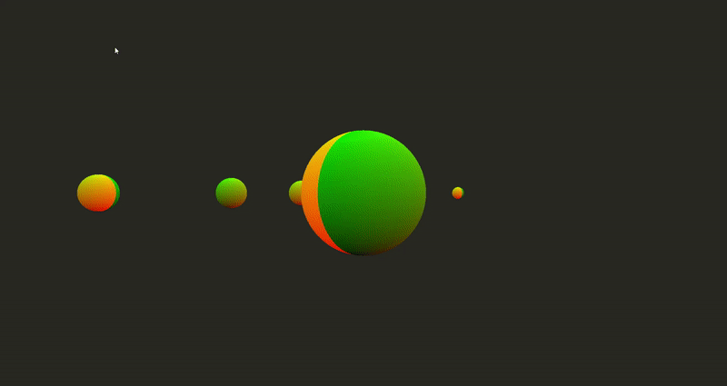

# Computer_Graphics
Computer graphics is a fundamental tool for creating and manipulating visual media including games, animation, virtual reality and web.
From implementing a simple 2D animation of circles, I developed my code to Geometric modeling of a 3D sphere, 3D transformations with camera interaction and shading / textures / normal mapping.

## 1. Moving Circles

    ◻ Press 'd' key to see flowers.
    ◻ Press 3(Triagle), 4(Square), 5(Pentagon), 0(Circle) to change shape.
    ◻ Press 'g' key to add gravity.

## 2. Planet in Space

    ◻ Press 'w' key to toggle wireframe.
    ◻ Press 'r' key to rotate and stop the sphere.
    ◻ Press 'd' key to toggle(tc.xy, 0) > (tc.xxx) > (tc.yyy) > special color
    ◻ Press 't' key to make torus.

## 3. Moving Planets

    ◻ Press 'w' key to toggle wireframe.
    ◻ 'Right click' or 'Shift + left click' to zooming.
    ◻ 'Middle click' or 'Ctrl + left click' to panning.
    ◻ Press 't' key to make torus.
    ◻ Press 'd' key to toggle space color(twinkle).

## 4. Full Solar System

    ◻ 'Right click' or 'Shift + left click' to zooming.
    ◻ 'Middle click' or 'Ctrl + left click' to panning.
    ◻ Press 'r' key to rotate and stop the sphere.
    ◻ Press 'n' to see a normal mapping of the planets.

## 5. Nomal Mapping (Earth)

# Copy Right
> Most of header files are provided by Prof Sungkil Lee.

> Planets's normal and bump texture jpg file is from http://planetpixelemporium.com/